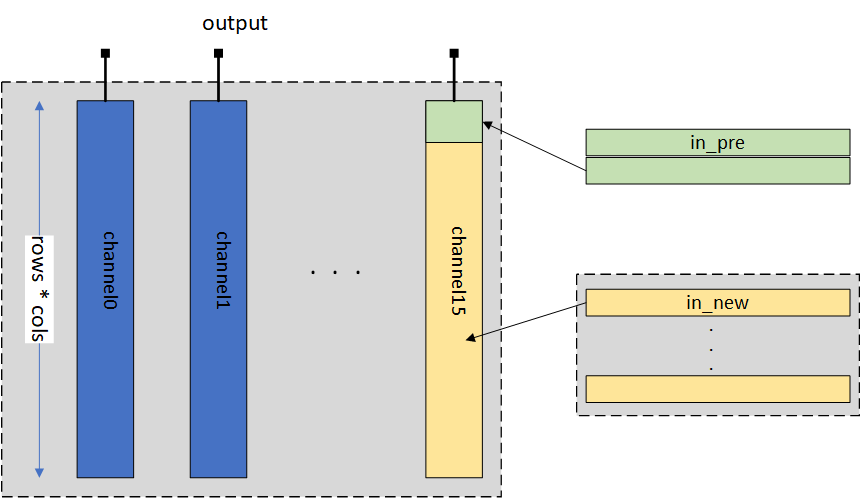
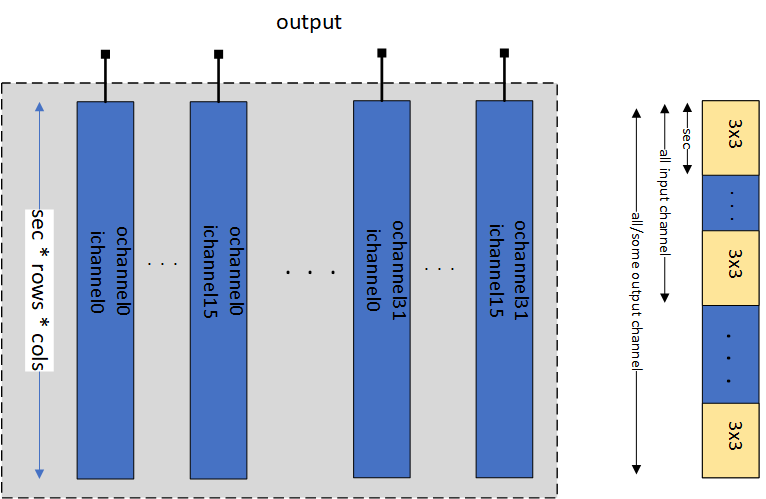
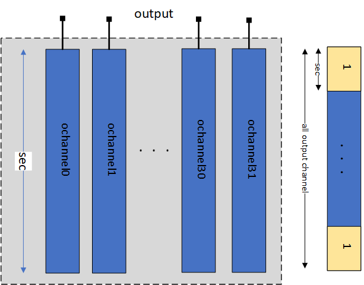
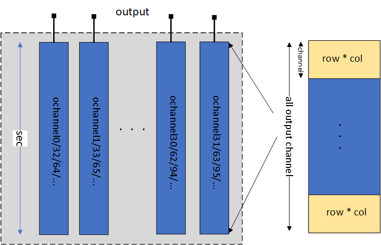

# Embedded CNN in FPGA

## Top view

This code aims to implement CNN in SOC FPGA using HLS tool (mainly C++). 
First, it reads input image and load parameter from disk file. 
Then, it starts CNN ops in FPGA. When it's done, it output 1000 
classification result to off-chip memory.

## Code hierarchy

The codes are mainly included in /src directory, as shown belows.

  - main.cpp: top module of the whole system.

  - common.cpp: some common definition about the network and on-chip arch.

  - /cpu: code executed in CPU side.

  - /data: code related to read data and parameter from disk.

  - /fpga: code related to SOC FPGA.

  - /utils: code related to checking data and output results.

Also, there are some Python code aiming to extract parameters and features 
from Caffe Toolkits, mainly included in /src/../pytools/.

## Arch details

### Conv layer

The Conv layer parallelize among input and output channel 
(16 input channel / 32 output channel). All data in other dimensions are fed 
sequentially to the core system, like rows and cols for kernels and input 
features in one channel.

#### Input buffer

To maximize the efficiency of BRAM, input buffer adopts tiled style buffer 
arch. That is, we only read part of input data into on-chip memory each time. 
For input with 224 columns, 16(channel)x4(row)x224(col) data will be 
read each time; for 112 columns, it is 16x8x112; for 56 columns, 
it is 16x16x56; for 28 columns, it is 16x28x28; for 14 columns it is 16x14x14.

The on-chip data arrangement is as follows:  
Input in different channels are stored in different BRAMs, so, there are total 
16 separate BRAMs. Since, it is a tile-based design, we need to store previous 
data and load the data (in_pre), as well as new data (in_new) in next reading cycle, as show in the figure.



#### Weight buffer

Weight buffer in Conv layers consume most of the on-chip BRAM resource. Since 
it parallelize among 16 input and 32 output channels, to feed all these 
weights in one clock cycle, it will need 16x32=512 separate BRAMs. In one BRAM,
the buffer will first store all input channel weight in one output channel, 
then next output channel. In first few layers, all the weights can be loaded 
into weight buffer one time. However, for last few layers, we need load all 
the weight in several times. 



#### Bias buffer

Bias buffer also using BRAM. To increase memory throughput, bias buffer is 
built using 32 separated BRAM, in which each BRAM corresponds to one output 
channel.



#### Output buffer

Output buffer is designed to store at most all 512 output channel result. 
For output with 224 columns, it store 64 (channel) x 2 (row) x 224 (col) data;
for 112 columns, it stores 128 x 6 x 112 data; for 56 columns, it stores 
256 x 14 x 56 data; for 28 columns, it stores 512 x 28 x 28 data; for 14 
columns, it stores 512 x 14 x 14 data.



#### PEs

Each PE is related to one input or output channel pixel. All other data are 
fed sequentially to the PE array. The whole process can be represented as 
belows:

```C++
for (int row = 0; row < RowNum; row++){
    for (int col = 0; col < ColNum; col++){
        for (int k1 = 0; k1 < Kern; k1++){
            for (int k2 = 0; k2 < Kern; k2++){
            #pragma HLS PIPELINE
                for (int m = 0; m < OChnl; m++){
                    for (int n = 0; n < IChnl; n++){
                        // PE array
                    }
                }
            }
        }
    }
}
```

### FC layer

#### Input/Output buffer

Input/Output buffer are all norm BRAMs with 1-data width input/output port. 
Input/Output buffer are designed to work in ping-pang. 

#### Weight buffer

Since weights in FC layer is too huge to be loaded into on-chip memory in one 
cycle, therefore, weight buffer in FC layer adopts tile-based design. In each 
cycle, we read 64 (input channel) * 1024 (output channel) to on-chip memory. 
There are total 64 BRAMS needed in weight buffer.

#### PEs

PE array in FC layer parallelize among "input channels", output result are 
calculated in a pipelined way, as shown below:

```C++
for (int m = 0; m < OChnl; m++){
#pragma HLS PIPELINE
    for (int n = 0; n < IChnl, n++){
        // PE array
    }
}
```